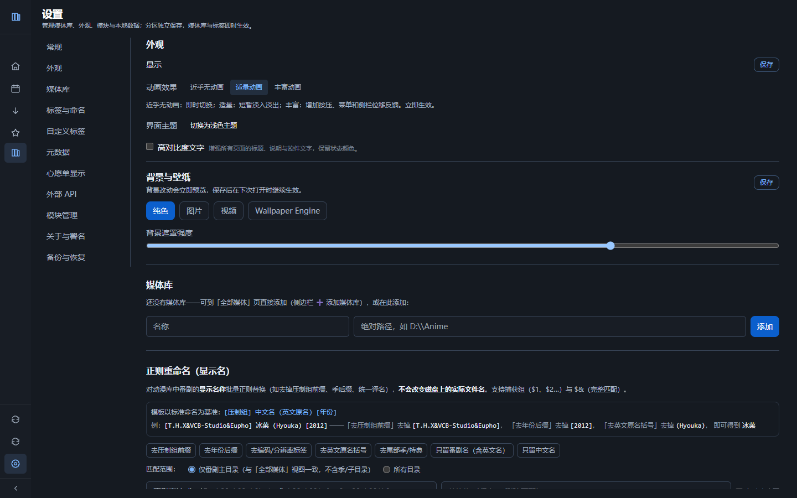

# AnimeShelf

[English](README.en.md)

AnimeShelf 是一款面向 Windows 的本地动漫与影视媒体库管理工具。它把电脑上的媒体目录整理为可浏览的作品库：用表格或海报查看收藏，补充作品名称、简介和封面，再按类型、标签、合集与追番计划进行整理。

媒体文件仍保存在你选择的文件夹中；AnimeShelf 记录它们的位置和作品资料，不会在导入时复制一份媒体文件。

*当前公开版本的实际设置界面，截图中尚未添加媒体库。*

## 主要功能

- **浏览收藏**：以表格或海报浏览本地作品，按名称搜索，使用排序与筛选查看收藏。
- **整理作品资料**：从 AniList、Bangumi、TMDB 匹配名称、简介、封面等资料，也可以手动编辑显示信息。
- **分类与合集**：区分动画和影视，使用标签、季度与目录分组整理作品，并将相关目录设为合集。
- **追番与心愿单**：查看放送信息，收藏感兴趣的作品，并从作品名称发起资源搜索。
- **资源搜索**：查询 Bangumi.moe、ACG.RIP、动漫花园和 Nyaa 的发布列表，搜索关键词、筛选来源并跳转到原站详情。侧栏中的「下载」是资源搜索入口，**不内置自动下载媒体文件的功能**。
- **个性化与备份**：调整主题、显示和壁纸，备份媒体库记录及设置。

## 当前版本与获取方式

当前提供 Windows 桌面版源码，仓库中的项目版本号为 **1.0.0**。截至 **2026-09-23**，仓库尚未发布 Release，也没有可直接下载的 Windows EXE 或安装包。

- **获取源码**：在[仓库页面](https://github.com/RenaKana/AnimeShelf)选择 **Code → Download ZIP**，或使用 Git 克隆。
- **运行软件**：按[源码运行说明](docs/DEVELOPMENT.md)准备环境并启动，在浏览器访问启动器显示的本机地址。
- **自行构建桌面程序**：开发文档提供 Windows 便携 EXE 的构建方法。源码 ZIP 本身不是可双击运行的程序。

以后提供的程序包以 [Releases 页面](https://github.com/RenaKana/AnimeShelf/releases)为准。

## 首次使用

1. **启动软件**：按源码运行说明启动，在浏览器打开显示的地址；自行构建便携版后可直接运行 EXE。
2. **添加媒体库**：进入「全部媒体」，使用「添加媒体库」，填写名称、已有文件夹的绝对路径，并选择「动画」或「影视」。
3. **扫描文件**：在「设置 → 常规 → Everything」填写 Everything HTTP Server 地址，再进入媒体库点击「扫描媒体库」。首次导入和后续更新文件索引都需要这个服务；添加目录本身不等于已扫描。
4. **浏览与匹配资料**：切换「表格」或「海报」，打开作品详情，在「海报与元数据」中点击「匹配元数据」，核对候选作品后完成匹配。
5. **整理收藏**：调整作品类型和标签，在「季度与目录」整理分组；需要合并浏览的目录可「设为合集」。通过「追番」和「心愿单」管理感兴趣的作品。
6. **保存备份**：进入「设置 → 备份与恢复」，设置备份位置并执行手动备份。重要的文件操作和升级前再备份一次。

详细步骤及操作限制见[使用指南](docs/USER-GUIDE.md)。

**文件操作提醒：**修改显示名称与重命名磁盘目录是不同操作。磁盘目录的重命名、移动和删除会影响真实文件，**删除不会进入回收站**。操作前核对路径，并另外备份重要媒体文件。

## 作品资料来源与可选配置

在「设置 → 元数据」配置资料来源。下表中的凭据属于对应第三方平台，**不是向 AnimeShelf 购买的服务，也不是本机 API 令牌**。

| 来源 | 用途 | 是否需要自行提供凭据 |
| --- | --- | --- |
| AniList | 动画作品信息、封面及追番相关资料 | 当前接入不需要用户 Key 或登录令牌。 |
| Bangumi | 作品信息、封面及放送资料 | 「Bangumi Access Token」可选，不填写也可进行当前的公开资料查询。 |
| TMDB | 电影与剧集的作品信息、封面 | 使用 TMDB 匹配必须填写自己的「TMDB API Key」；不使用 TMDB 时可留空。 |

密钥或令牌须向对应平台申请并遵守其条件。界面中的隐藏显示不等于磁盘加密；请保护本机数据与备份。服务可用性、请求限制及资料完整性取决于对应平台，匹配结果需要自行核对。

### Everything 与其他外部工具

Everything HTTP Server 是**扫描和导入本地文件所需的外部服务**，需要单独安装、启用并索引媒体所在目录。默认地址为 `http://localhost:1223`，应按自己的实际配置修改。AnimeShelf 不捆绑 Everything，也没有另一套直接扫描磁盘的后备方式。

浏览已经入库的记录、整理现有收藏，不要求 Everything 始终运行。作品资料获取和资源搜索需要联网。壁纸使用你自己的素材；Wallpaper Engine 仅在选择相应壁纸方式时需要，不是软件启动条件。

## 本机 API 与工具集成（进阶）

本机 API 用于让**你自己的脚本或其他工具**读取媒体库，或在授权后修改资料。它默认关闭，不影响普通使用。

需要时在「设置 → 外部 API」启用服务并创建令牌。服务仅监听本机 `127.0.0.1`；优先使用只读权限，只向可信工具授予修改或文件操作权限。完整令牌只显示一次，请妥善保存，勿放进网址、截图或公开仓库，也不要把应用的管理端口暴露到公网。

这类令牌由你在本机创建，与 AniList、Bangumi、TMDB 的账号和凭据无关。详见[本机 API 文档](docs/external-api.md)。

## 数据与备份

- **保存位置**：源码运行默认使用项目下的 `data/`；自行构建的便携版默认使用 EXE 旁的 `data/`。自定义位置见使用指南。浏览器缓存另存于 Windows 用户配置目录。
- **备份范围**：数据库备份保存媒体库记录、设置及可能存在的凭据；海报有单独的备份选项。**这些备份不包含原始视频等媒体文件**，媒体文件需要另行备份。
- **备份入口**：「设置 → 备份与恢复」。自动备份默认位于数据目录的 `backups/auto/`，保留最近 10 份数据库备份；手动备份默认保存到 Windows 桌面，也可修改目录。
- **升级与迁移**：先退出软件，另存完整数据目录及媒体文件备份，再更新程序。恢复前查看预检结果并核对路径；恢复会替换当前库记录，不是合并导入。
- **兼容限制**：当前版本拒绝打开或恢复含手机同步结构的旧数据库和备份。遇到不兼容提示时保留原文件，改用新的独立数据目录；不要删除表或覆盖唯一副本来强行导入。

备份可能包含密钥、令牌、私人路径和收藏记录。不要把数据库、备份或整个数据目录上传到公开问题反馈中。详见[使用指南](docs/USER-GUIDE.md)和[隐私说明](docs/PRIVACY.md)。

## 常见问题

**为什么添加目录后看不到作品？**

添加媒体库只保存目录配置。确认 Everything HTTP Server 可访问、已索引该目录，然后执行「扫描媒体库」。扫描失败时先处理连接或路径问题，不要通过删除数据库重新开始。

**必须配置所有资料来源吗？**

不需要。AniList 的当前接入无需用户凭据，Bangumi Token 可选；只有使用 TMDB 时才需要自己的 TMDB Key。这些配置不属于 AnimeShelf 的付费入口。

**「下载」页面会直接下载视频吗？**

不会。它提供搜索、结果列表和原站详情跳转。各来源可能不可访问或限制请求；内置搜索不代表站点保证可用，也不代表获得媒体内容的使用许可。

**不联网还能用吗？**

可以浏览已经保存的本地媒体库记录。在线匹配、远程海报、放送资料刷新和资源搜索需要访问相应服务。

## 开发文档与许可证

源码环境、技术栈、测试和构建步骤集中在[开发与构建](docs/DEVELOPMENT.md)。扩展参考见[模块开发](docs/modules.md)、[下载来源接口](docs/download-sources-api.md)及[本机 API](docs/external-api.md)。

项目代码采用 [MIT 许可证](LICENSE)，Copyright (c) 2026 Rena。作品资料来源包括 AniList、Bangumi、TMDB 及 [bangumi-data](https://github.com/bangumi-data/bangumi-data)（CC BY 4.0）。本产品使用 TMDB API，但未经 TMDB 认可或认证。

第三方依赖、数据、海报和素材各有自己的许可与使用条件；项目许可证不替代这些授权。相关署名与尚待确认的使用条件见[第三方说明](docs/THIRD-PARTY.md)、[依赖声明](THIRD-PARTY-NOTICES.txt)和[素材来源](docs/ASSET-PROVENANCE.md)。
